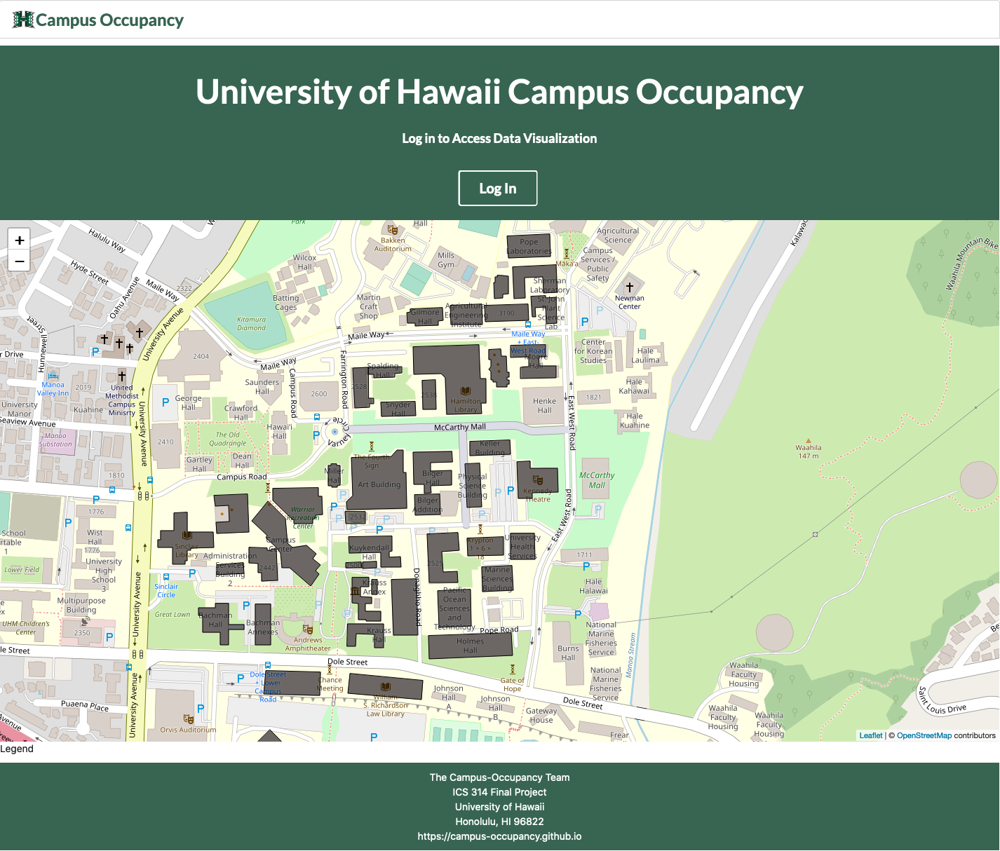
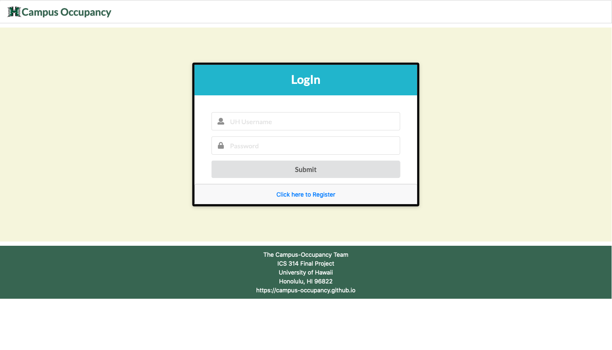
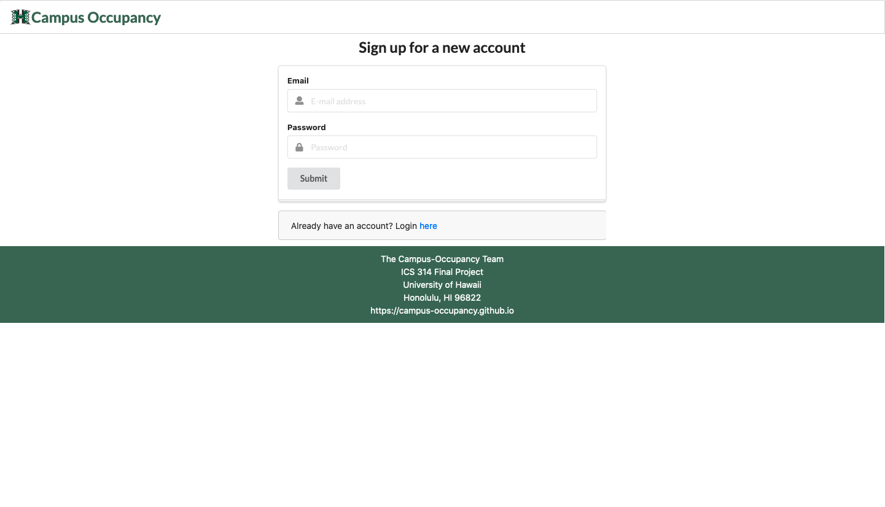
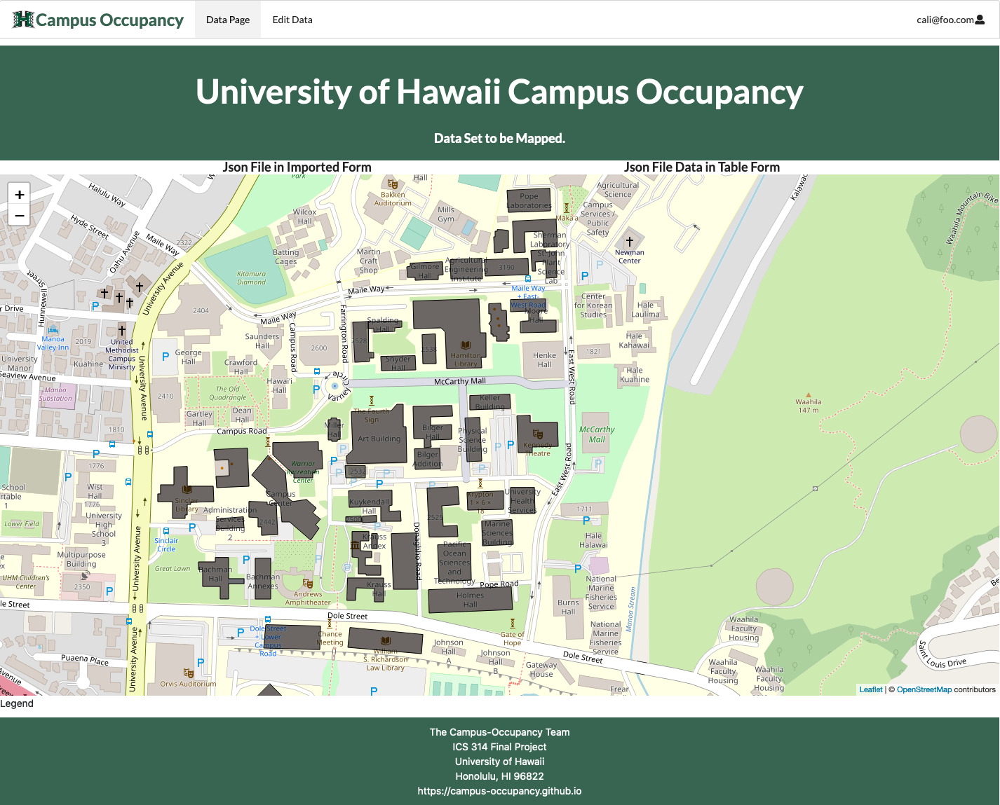

## Table of contents
* [Problem](#problem)
* [Goals](#goals)
* [Planned Additions to project](#planned-additions-to-project)
* [Mockup page Ideas](#mockup-page-ideas)
* [Case Ideas](#case-ideas)
* [User Guide](#user-guide)
* [Developer Guide](#developer-guide)
* [Development history](#development-history)
* [Beyond the Basic](#beyond-the-basic)
* [Contact Us](#contact-us)

## Problem:
The challenge is to develop a way for the college to visualize occupancy of the campus.  The three current purposes are to assist in scheduling on the campus, assess social distancing and group density, and help with long term facility planning.  The application is intended for the university administration. The data available is anonymized to protect the identities of the visitors to the campus. 

## Goals

Campus Occupancy is an example web application that provides the visualization of the amount of people in a building. Basically the main goal is to have a map that can also show indoor grouping of visitors. 

## Planned Additions to project

We plan to add ease of access features to make the web application easier for the user. One of these additions would be a slider which filters the population of the building from most dense to least dense. 
 
 
## Mockup page Ideas:
Implement visualizations with the D3 JavaScript library. 
Admin page displays the visualizations occupancy of the campus.


## Case Ideas:
The landing page will display the login. After logging in as an admin, the page is directed to the admin page. In this page it will display the visualized occupancy of the campus. There will be options for the admin user such as to edit or add data.


## User Guide

This section provides the current walkthrough of the campus visualization user interface and its capabilities.

### Link to Current Website: 
[UHManoaCampusOccupancy](http://164.90.146.203/#/)

### Landing Page

The landing page is presented to users when they visit the top-level URL to the site.



### Sign in Page 
Click on the "Login" button in the middle of the screen, then select "Sign in" to go to the following page and login. You must have been previously registered with the system to use this option:



### Sign up Page 
You can select "Sign up" to go to the following page and register as a new user:



### Data Page 
After logging in, you are taken to the edit data page, which presents a table where you can view the data:




### Edit Data page 

Once you are logged in, you can edit data by uploading a .csv file of your data and generate the map:


## Developer Guide: 
This section provides information to any Meteor developers intrested in using this code for their own developement.

### Installation
Install [Meteor](https://www.meteor.com/install).

Then go to [https://github.com/campus-occupancy/campus-occupancy](https://github.com/campus-occupancy/campus-occupancy) and click on the Green Code button to download a new GitHub repo to your local file system. Using the [Github Desktop](https://desktop.github.com/) is recomended for both Windows or MacOS users.

cd into the app directory and install third party libraries with:
``````````
$ meteor npm install
``````````

### Run the System
After installing the libraries, you may run the application with:
`````````
$ meteor npm run start
`````````

### View the app
Once the app is running, the application will appear at [http://localhost:3000/](http://localhost:3000/).

### Run ESLint
To verify that your code complies with the coding standards, run the ESLint over the code in the imports/directory with:
````````
meteor npm run lint
````````

## Development history:
The campus occupancy project followed the [Issue Driven Project Management Practices](http://courses.ics.hawaii.edu/ics314f19/modules/project-management/).

### Milestone 1: Mockup development
The goal of Milestone 1 was to start devoloping a rough version of the mockups provided in the above section.
[Here is a link to Milestone 1](https://github.com/campus-occupancy/campus-occupancy/projects/1)


 
### Milestone 2:
 [Here is a link to Milestone 2](https://github.com/campus-occupancy/campus-occupancy/projects/2)
 
## Beyond the Basic:
This application could be used to dispatch the campus security to monitor behavior if real-time data is used.  It could also be used to direct cleaning crews on areas that need extra attention at the end of the day.  The information collected on actual human traffic behavior, could be used to evaluate current emergency policies that the campus has in place including evacuation plans. 
Possible additional uses for this application include it being used as a framework for other facilities (schools, malls, public facilities) to monitor human traffic and group sizes.  Additionally it would be beneficial to have the application be rendered in a three dimensional view, so that multi-level facilities can see exactly where the groups are. 

## Contact Us

[Caliana Fortin](https://calianafortin.github.io/)  


[Fred Straub](https://fredstraub.github.io/) 


[Marcos Buccat](https://buccatm.github.io/) 


