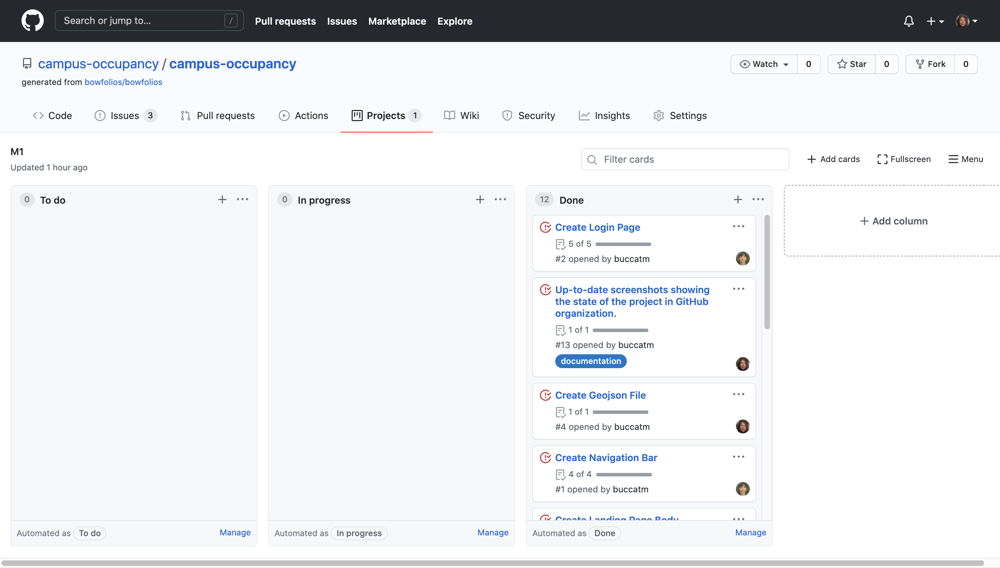

## Table of contents
* [Overview](#overview)
* [User Guide](#user-guide)
* [Community Feedback](#community-feedback)
* [Developer Guide](#developer-guide)
* [Development history](#development-history)
* [Beyond the Basic](#beyond-the-basic)
* [Contact Us](#contact-us)


## Overview

### Problem

The challenge is to develop a way for the college to visualize occupancy of the campus.  The three current purposes are to assist in scheduling on the campus, assess social distancing and group density, and help with long term facility planning.  The application is intended for the university administration. The data available is anonymized to protect the identities of the visitors to the campus. 

### Goals

Campus Occupancy is an example web application that provides the visualization of the amount of people in a building. Basically the main goal is to have a map that can also show indoor grouping of visitors. 

### Planned Additions to project

We plan to add ease of access features to make the web application easier for the user. One of these additions would be a slider which filters the population of the building from most dense to least dense. 
 
 
### Mockup page Ideas
Implement visualizations with the D3 JavaScript library. 
Admin page displays the visualizations occupancy of the campus.


### Case Ideas
The landing page will display the login. After logging in as an admin, the page is directed to the admin page. In this page it will display the visualized occupancy of the campus. There will be options for the admin user such as to edit or add data.


## User Guide

This section provides the current walkthrough of the campus visualization user interface and its capabilities.

### Landing Page

The landing page is presented to users when they visit the top-level URL to the site. In this page the user is able to see the map and the visualized data.


### Sign in Page 
Click on the "Login" button in the middle of the screen, then select "Sign in" to go to the following page and login. You must have been previously registered with the system to use this option:


### Sign up Page 
You can click on "click here to Register" to go to the following page and register as a new user:


### Sign Out Page
After loggin out, you are given the option to go to the login or the landing page.


### Data Page 
After logging in, you are taken to the edit data page, which presents a table where you can view the data:


### Edit Data page 

Once you are logged in, you can edit data by uploading a .csv file of your data and generate the map:


## Developer Guide 
This section provides information to any Meteor developers intrested in using this code for their own developement.


### Installation
First, install [Meteor](https://www.meteor.com/install).

Second go to [https://github.com/campus-occupancy/campus-occupancy](https://github.com/campus-occupancy/campus-occupancy) and click on the Green "Code" button to download the sources as a Zip file to create a copy of the application on your local computer. Alternatively, you may fork this repo.  

Third, cd into the campus-occupancy/app directory and install the libraries with:
``````````
$ meteor npm install
``````````

### Run the System
After downloading a copy of the application and installing the libraries, you can run the system with:
`````````
$ meteor npm run start
`````````

### View the app
Once the app is running, the application will appear at [http://localhost:3000/](http://localhost:3000/).

### Run ESLint
To verify that your code complies with the coding standards, run the ESLint over the code in the imports/directory with:
````````
meteor npm run lint
````````

### End to End Testing 
Campus Occupancy uses [TestCafe](https://devexpress.github.io/testcafe/) to provide the automated end-to-end testing. The Campus Occupancy test code employs the page model design.

To run the end-to-end test in developement mode, first run the campus occupancy application. Then on a separate console window invoke:
`````
meteor npm run testcafe-development
`````
A browser will appear to display the each of the test cases. If the test is successful, on the console window all the test cases should have a green check mark.

Should you need to run the testcafe in "continuous integration mode", first check that the campus occupancy application is not running. Then, invoke `meteor npm run testcafe-ci`. No browser will appear but you can check the console to see if the test passed.

### Continuous Integration


Campus-Occupancy uses GitHub Actions to automatically run ESLint and TestCafe each time a commit is done to the master Branch. You can see the results of all the workflow [here](https://github.com/campus-occupancy/campus-occupancy/actions?query=workflow%3Aci-campus-occupancy). 

The workflow file for this application is defined at [.github/workflow/ci.yml](https://github.com/campus-occupancy/campus-occupancy/tree/master/.github/workflows).

### Link to Current Website: 
[UHManoaCampusOccupancy](https://campus-occupancy.top/#/)

### Link to Source Code:
Here is the link to the application repo containing the [Source Code](https://github.com/campus-occupancy/campus-occupancy).


## Community Feedback
If you would like to help us improve the system, please take a couple of minutes to fill out the [Campus Occupancy Form](https://docs.google.com/forms/d/e/1FAIpQLSfnveBnx1LZj3YNTj0HMstZ6XzbBA0aZ_pJ9VzaPV4QQ84img/viewform). We are intrested in your experiance using the application.


## Development history
The campus occupancy project followed the [Issue Driven Project Management Practices](http://courses.ics.hawaii.edu/ics314f19/modules/project-management/).

### Milestone 1: Mockup development
The goal of Milestone 1 was to start devoloping a rough version of the mockups provided in the above section.
[Here is a link to Milestone 1](https://github.com/campus-occupancy/campus-occupancy/projects/1)


 
### Milestone 2: Improvement to the System
The goal of Milestone 2 was to improve the functionality and quality of the application. So for Milestone 2, the goal was to get the map to visualize our data. Then test our system by implementing TestCafe "availability" tests for all our pages.
 [Here is a link to Milestone 2](https://github.com/campus-occupancy/campus-occupancy/projects/2)
 
 
 
### Milestone 3: 
[Here is a link to Milestone 3](https://github.com/campus-occupancy/campus-occupancy/projects/3)


## Beyond the Basic:
This application could be used to dispatch the campus security to monitor behavior if real-time data is used.  It could also be used to direct cleaning crews on areas that need extra attention at the end of the day. The information collected on actual human traffic behavior, could be used to evaluate current emergency policies that the campus has in place including evacuation plans. 
Possible additional uses for this application include it being used as a framework for other facilities (schools, malls, public facilities) to monitor human traffic and group sizes.  Additionally it would be beneficial to have the application be rendered in a three dimensional view, so that multi-level facilities can see exactly where the groups are. 


## Contact Us

[Caliana Fortin](https://calianafortin.github.io/)  


[Fred Straub](https://fredstraub.github.io/) 


[Marcos Buccat](https://buccatm.github.io/) 


